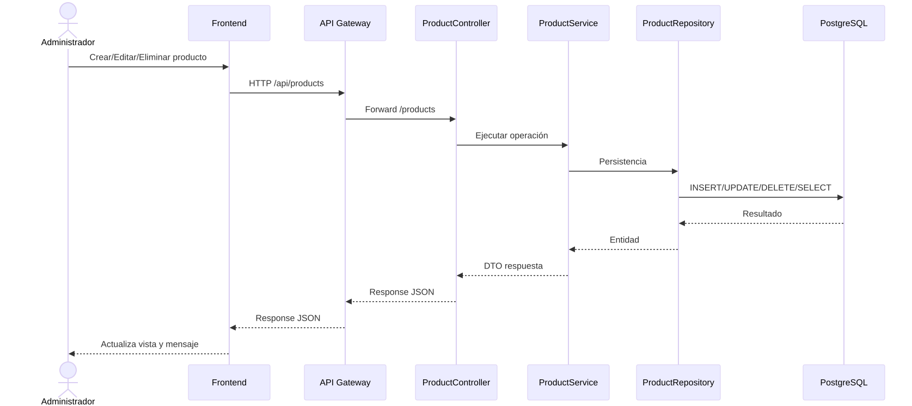
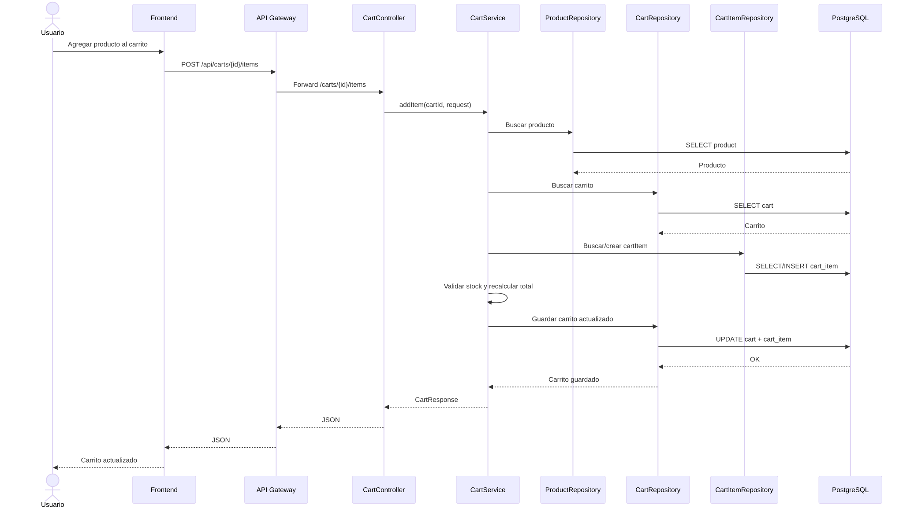

# 🧩 UML Diagrams - MiniCart

## 1) Casos de uso

## 2) Componentes

## 3) Clases de dominio

## 4) Secuencia - Gestión de productos

## 5) Secuencia - Gestión de carrito

## 6) Despliegue (Docker Compose)

## 7) Actividad - Agregar ítem al carrito

